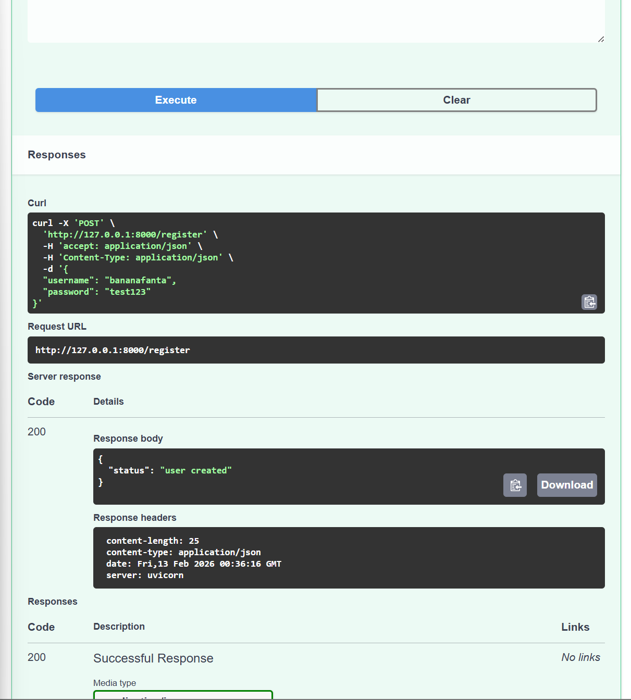
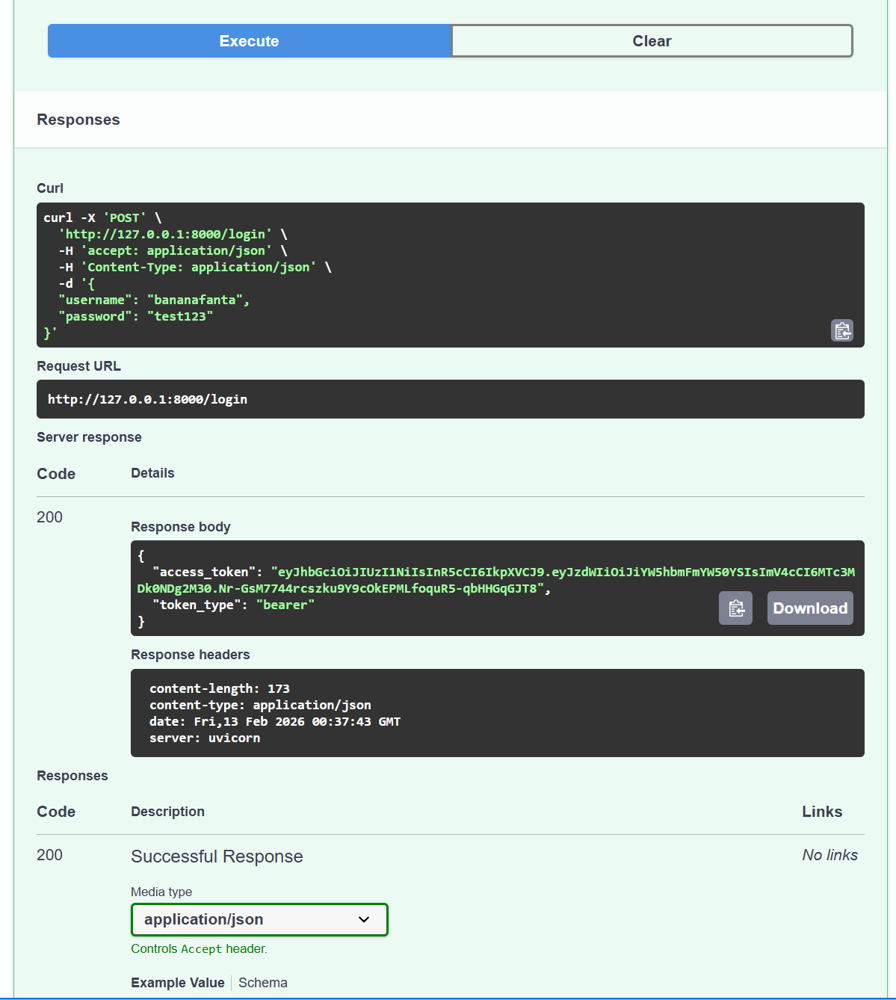
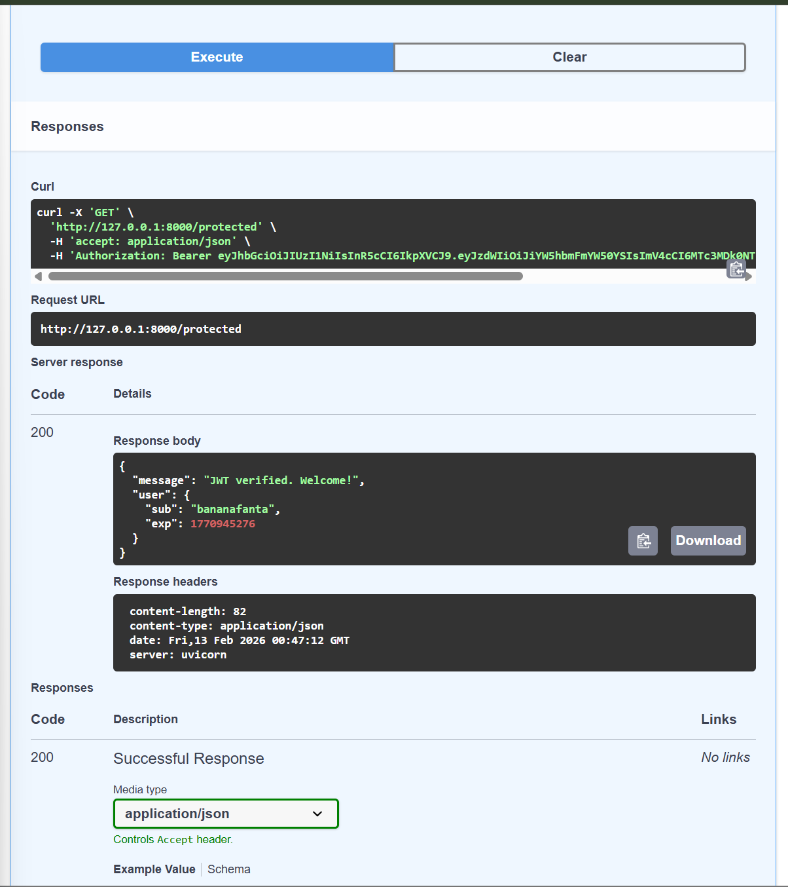

# Auth API Project

This project is a FastAPI application that provides user authentication features, including user registration, login, and protected routes. It uses SQLAlchemy for database interactions and JWT for token-based authentication.

## Project Structure

```
AuthAPI/
├── main.py        # FastAPI application
├── images/        # Screenshots used in the README
└── README.md      # Project documentation
```

## Features

- User registration
- User login
- Protected routes with JWT authentication

## Setup Instructions

1. **Clone the repository:**

	```bash
	git clone https://github.com/Shareef91/AuthAPI.git
	cd AuthAPI
	```

2. **Install dependencies:**

	```bash
	pip install -r requirements.txt
	```

3. **Run the application:**

	```bash
	uvicorn main:app --reload
	```

4. **Open the API docs:**

	- Swagger UI: `/docs`
	- ReDoc: `/redoc`

## Images




